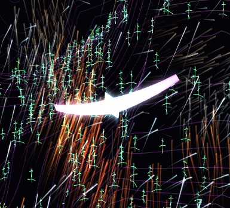

# bir3d

A neon glider soaring a procedural ridgeline — a WebGPU sandbox built on a CPU-integrated
flight model riding a live GPU fluid wind field.



**▶ Live: https://eighteyes.github.io/bir3d/**

> Requires a WebGPU-capable browser (Chrome / Edge, or Safari Technology Preview) on a machine
> with a GPU. On unsupported browsers the canvas stays blank.

## Fly it

- **Mouse** steers — cursor offset from screen-center sets turn rate (yaw) and nose attitude (pitch).
- Pure glide: **dive** to gain speed, **pull up** to zoom-climb, ride **ridge lift** to stay aloft.
- Fly to the amber **target** beam; reach it and it respawns ahead.
- **P** hands control to the autopilot · **T** toggles the live tuning panel.

## What's under it

- **Terrain** — neon ridgeline from an fBm height field (EKG scan-lines / world-static grid / topo).
- **Wind** — a real GPU fluid sim (`FluidWind`) evolves a wind field over a bird-local moving window;
  the same field pushes the glider *and* draws the visible streamline comets.
- **Bird** — CPU-integrated glider physics (lift/drag/gravity) flying the sampled wind.
- **Bloom** — HDR `rgba16float` scene → threshold → separable blur → Reinhard tone-map.

## Develop

```
npm install
npm run dev        # http://localhost:5173/index-bird.html
npm run deploy     # build + publish dist/ to the gh-pages branch
```

Other entries: `/index-fluid.html` (fluid debug viz) · `/vector.html` (compute foundation demo).
